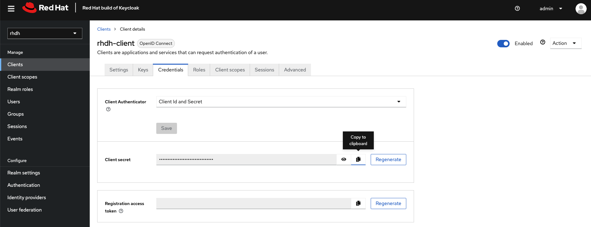

# Keycloak Installation 

**_All actions will be executed within the 'demo-project' namespace on OpenShift, unless otherwise specified.
Next to that, be aware that the root domain will be different for you, and it will be the root domain of your 
OpenShift cluster._**

## Setup

* Log in into OpenShift via the CLI (i.e., oc login ....)
* Install the operator in the 'demo-project' namespace.
* Apply the following yaml:  
    **TODO: make use of basedomain variable** 
    **!!! be aware to change the root domain (i.e., apps.cluster-zcsd6.dynamic.redhatworkshops.io) to your own domain.**
```yaml
apiVersion: k8s.keycloak.org/v2alpha1
kind: Keycloak
metadata:
  name: demo-keycloak-instance
  labels:
    app: sso
  namespace: demo-project
spec:
  http:
    httpEnabled: true
  hostname:
    # following would be better and easier to secure, but for demo purposes, 
    # we'll make both hostname and admin URL the same (fewer certificates' config)
    # adminUrl: 'https://admin.demo-keycloak-instance.apps.cluster-zcsd6.dynamic.redhatworkshops.io'
    adminUrl: 'https://demo-keycloak-instance.apps.cluster-zcsd6.dynamic.redhatworkshops.io'
    hostname: demo-keycloak-instance.apps.cluster-zcsd6.dynamic.redhatworkshops.io
  instances: 1
```
* Wait for the operator to become ready and get the route to keycloak:
```shell
oc get route $(oc get routes -n demo-project -o jsonpath='{range .items[*]}{.metadata.name}{"\n"}{end}' | grep demo-keycloak-instance) \
  -n demo-project \
  -o template --template='{{.spec.host}}'\ 
  ; echo
```
* Get the admin secret:
```shell
oc get secret demo-keycloak-instance-initial-admin -n demo-project -o template --template='{{.data.password}}' | base64 -d ; echo
```
* Log in into keycloak (i.e., https://demo-keycloak-instance.apps.cluster-zcsd6.dynamic.redhatworkshops.io/)
* Configure the Red Hat Developer Hub realm (or import [configurations/keycloak-realm-import.json](configurations/keycloak-realm-import.json) directly into keycloak or apply
the realm import yaml in OpenShift (but make sure that you have persistent storage under keycloak then): [configurations/keycloak-realm-import.yaml](configurations/keycloak-realm-import.yaml)):
  * Create realm: rhdh
  * Create Confidential client: rhdh-client
    * Root URL: empty
    * Valid redirect URIs: <developer hub url>/*  (see section 'Install Red Hat Developer Hub via operator' in the README to retrieve the URL if you don't find it).
    * Take the secret from the client  
      
    * Service account must be enabled
    * The following roles must be added from the realm-management client role:
      * query-groups
      * query-users
      * view-users
  * Create user
    * username: user1
    * email: user1@rhdh-demo.com
    * email verified: true
    * first name: user1
    * last name: rhdh-demo
    * Now go to credentials tab and click "set password"
      * password: rhdh
      * temporary: off